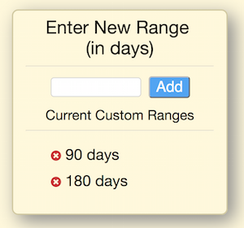

# Google Search Quick Custom Ranges

This extension grants you the ability to add additional quick searches to the Tools -> Search Menu

In options you can add and remove custom ranges. The default ranges are 90 and 180 days. If you remove all custom ranges the defaults will be restored. Integers from 0-999 are accepted.

